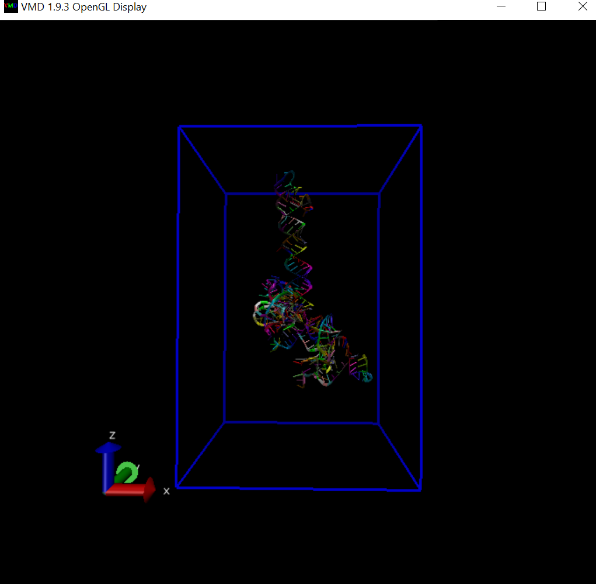
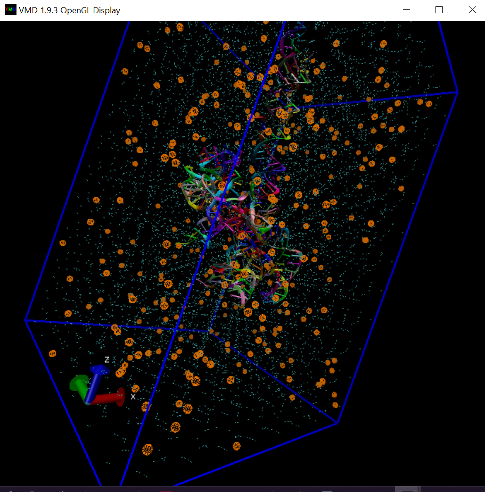

# GROMACS tutorial for RNA molecular dynamics simulation

All the files you need to start MD on 3'end RNA of Zika Virus

This example will guide newbies through the process of setting up a simulation system containing an RNA molecule (3'end Zika virus genome) in a box of water, with ions. Each step will contain an explanation of input and output, using typical settings for general use.

This tutorial assumes you are using a [GROMACS](http://www.gromacs.org/) version in the 2018.1

## Create topology

Verified that all the necessary atoms are present. Always check your pdb file for MISSING entries, as these entries indicate either atoms or whole residues that are not present in the crystal structure. Terminal regions may be absent, and may not present a problem for dynamics. Incomplete internal sequences or nucleic residues that have missing atoms will cause pdb2gmx to fail. These missing atoms/residues must be modeled in using other software packages: rosetta, robetta or molprobity. 

Please note that pdb2gmx is not magic. It cannot generate topologies for arbitrary molecules, just the residues defined by the force field (in the *.rtp files - generally proteins, nucleic acids, and a very finite amount of cofactors, like NAD(H) and ATP).
 
The purpose of pdb2gmx is to generate three files:

- The topology for the molecule.
- A position restraint file.
- A post-processed structure file.

The topology (topol.top by default) contains all the information necessary to define the molecule within a simulation. This information includes nonbonded parameters (atom types and charges) as well as bonded parameters (bonds, angles, and dihedrals). We will take a more detailed look at the topology once it has been generated.

Execute pdb2gmx by issuing the following command

`
gmx pdb2gmx -f ZIKA.pdb -o ZIKA_processed.gro -water spce -ignh
`
The structure will be processed by pdb2gmx, and you will be prompted to choose a force field:

```
GROMACS:      gmx pdb2gmx, version 2018.1
Executable:   /usr/bin/gmx
Data prefix:  /usr
Working dir:  /home/chris/Zika/Zika_MD
Command line:
  gmx pdb2gmx -f ZIKA.pdb -o ZIKA_processed.gro -water spce -ignh
Select the Force Field:
From '/usr/share/gromacs/top':
 1: AMBER03 protein, nucleic AMBER94 (Duan et al., J. Comp. Chem. 24, 1999-2012, 2003)
 2: AMBER94 force field (Cornell et al., JACS 117, 5179-5197, 1995)
 3: AMBER96 protein, nucleic AMBER94 (Kollman et al., Acc. Chem. Res. 29, 461-469, 1996)
 4: AMBER99 protein, nucleic AMBER94 (Wang et al., J. Comp. Chem. 21, 1049-1074, 2000)
 5: AMBER99SB protein, nucleic AMBER94 (Hornak et al., Proteins 65, 712-725, 2006)
 6: AMBER99SB-ILDN protein, nucleic AMBER94 (Lindorff-Larsen et al., Proteins 78, 1950-58, 2010)
 7: AMBERGS force field (Garcia & Sanbonmatsu, PNAS 99, 2782-2787, 2002)
 8: CHARMM27 all-atom force field (CHARM22 plus CMAP for proteins)
 9: GROMOS96 43a1 force field
10: GROMOS96 43a2 force field (improved alkane dihedrals)
11: GROMOS96 45a3 force field (Schuler JCC 2001 22 1205)
12: GROMOS96 53a5 force field (JCC 2004 vol 25 pag 1656)
13: GROMOS96 53a6 force field (JCC 2004 vol 25 pag 1656)
14: GROMOS96 54a7 force field (Eur. Biophys. J. (2011), 40,, 843-856, DOI: 10.1007/s00249-011-0700-9)
15: OPLS-AA/L all-atom force field (2001 aminoacid dihedrals)
```
The force field will contain the information that will be written to the topology. This the most important choice! You should always read thoroughly about each force field and decide which is most applicable to your situation. For this tutorial, we will use AMBER03 for nucleic acid, so type `1` at the command prompt, followed by 'Enter'.

Please note that we are using the option:

-ignh: Ignore H atoms in the PDB file; especially useful for NMR structures. Otherwise, if H atoms are present, they must be in the named exactly how the force fields in GROMACS expect them to be. Different conventions exist, so dealing with H atoms can occasionally be a headache! If you need to preserve the initial H coordinates, but renaming is required, then the Linux sed command is your friend.

You have now generated three new files: ZIKA_processed.gro, topol.top, and posre.itp. ZIKA_processed.gro is a GROMACS-formatted structure file that contains all the atoms defined within the force field (i.e., H atoms have been added to the amino acids in the protein). The topol.top file is the system topology (more on this in a minute). The posre.itp file contains information used to restrain the positions of heavy atoms (more on this later).

Let's look at what is in the output topology (topol.top). Inspect its contents using vi or nano, don't chage anythig!. After several comment lines (preceded by ;), you will find the following:

`
#include "amber03.ff/forcefield.itp"
`
This line calls the parameters within the AMBER03 force field. It is at the beginning of the file, indicating that all subsequent parameters are derived from this force field. The next important line is [ moleculetype ], below which you will find

```
[ moleculetype ]
; Name            nrexcl
RNA_chain_A         3

```

The next section defines the [ atoms ] in the protein. The information is presented as columns:

```
[ atoms ]
;   nr       type  resnr residue  atom   cgnr     charge       mass  typeB    chargeB      massB
; residue   1 G   rtp RG5  q -0.3
     1         OH      1      G    O5'      1    -0.6223         16   ; qtot -0.6223
     2         HO      1      G    H5T      2     0.4295      1.008   ; qtot -0.1928
     3         CT      1      G    C5'      3     0.0558      12.01   ; qtot -0.137
     4         H1      1      G   H5'1      4     0.0679      1.008   ; qtot -0.0691

```

The interpretation of this information is as follows:
nr: Atom number
type: Atom type
resnr: nucleotide residue number
residue: The  nucleotide residue name
atom: Atom name
cgnr: Charge group number
Charge groups define units of integer charge; they aid in speeding up calculations
charge: Self-explanatory
The "qtot" descriptor is a running total of the charge on the molecule
mass: Also self-explanatory
typeB, chargeB, massB: Used for free energy perturbation (not discussed here)
Subsequent sections include [ bonds ], [ pairs ], [ angles ], and [ dihedrals ]. Some of these sections are self-explanatory (bonds, angles, and dihedrals). The parameters and function types associated with these sections are elaborated on in Chapter 5 of the GROMACS manual. Special 1-4 interactions are included under "pairs" (section 5.3.4 of the GROMACS manual).

The remainder of the file involves defining a few other useful/necessary topologies, starting with position restraints. The "posre.itp" file was generated by pdb2gmx; it defines a force constant used to keep atoms in place during equilibration (more on this later).

```
; Include Position restraint file
#ifdef POSRES
#include "posre.itp"
#endif

; Include water topology
#include "amber03.ff/spce.itp"

#ifdef POSRES_WATER
; Position restraint for each water oxygen
[ position_restraints ]
;  i funct       fcx        fcy        fcz
   1    1       1000       1000       1000
#endif

; Include topology for ions
#include "amber03.ff/ions.itp"

[ system ]
; Name
Zika_RNA

[ molecules ]
; Compound        #mols
RNA_chain_A         1

```
This ends the moleculetype definition. The remainder of the topology file is dedicated to defining other molecules and providing system-level descriptions. The next moleculetype (by default) is the solvent, in this case SPC/E water. Other typical choices for water include SPC, TIP3P, and TIP4P. We chose this by passing "-water spce" to pdb2gmx. For an excellent summary of the many different water models, click here, but be aware that not all of these models are present within GROMACS.

The only parameter we are going to change at this stage is the [system] name. Gromacs is more commonly used for proteins so the defauld name is Protein, should be substitute for Zika_RNA for example.

A few key notes about the [ molecules ] directive:

The order of the listed molecules must exactly match the order of the molecules in the coordinate (in this case, .gro) file.
The names listed must match the [ moleculetype ] name for each species, not residue names or anything else.
If you fail to satisfy these concrete requirements at any time, you will get fatal errors from grompp (discussed later) about mismatched names, molecules not being found, or a number of others.

Now that we have examined the contents of a topology file, we can continue building our system.

## Generate a box and add water (solvatation)

Now that you are familiar with the contents of the GROMACS topology, it is time to continue building our system. In this example, we are going to be simulating a simple aqueous system. It is possible to simulate proteins and other molecules in different solvents, provided that good parameters are available for all species involved.

There are two steps to defining the box and filling it with solvent:
Define the box dimensions using the editconf module.
Fill the box with water using the solvate module (formerly called genbox).
You are now presented with a choice as to how to treat the unit cell. For the purpose of this tutorial, we will use a simple triclinic box as the unit cell. As you become more comfortable with periodic boundary conditions and box types, I highly recommend the rhombic dodecahedron, as its volume is ~71% of the cubic box of the same periodic distance, thus saving on the number of water molecules that need to be added to solvate the RNA molecule.

Let's define the box using editconf:

```
gmx editconf -f ZIKA_processed.gro -o ZIKA_newbox.gro -c -d 2.5 -bt triclinic
```

The above command centers the protein in the box (-c), and places it at least 2.5 nm from the box edge (-d 2.5). The box type is defined as a cube (-bt triclinic). The distance to the edge of the box is an important parameter. Since we will be using periodic boundary conditions, we must satisfy the minimum image convention. That is, a protein should never see its periodic image, otherwise the forces calculated will be spurious. Specifying a solute-box distance of 2.5 nm will mean that there are at least 2.0 nm between any two periodic images of the molecule. This distance will be sufficient for just about any cutoff scheme commonly used in simulations.



Now that we have defined a box, we can fill it with solvent (water). Solvation is accomplished using solvate:

```
gmx solvate -cp ZIKA_newbox.gro -cs spc216.gro -o ZIKA_solv.gro -p topol.top
```

The configuration of the RNA molecule (-cp) is contained in the output of the previous editconf step, and the configuration of the solvent (-cs) is part of the standard GROMACS installation. We are using spc216.gro, which is a generic equilibrated 3-point solvent model. You can use spc216.gro as the solvent configuration for SPC, SPC/E, or TIP3P water, since they are all three-point water models. The output is called ZIKA_solv.gro, and we tell solvate the name of the topology file (topol.top) so it can be modified. Note the changes to the [ molecules ] directive of topol.top:

```
[ molecules ]
; Compound        #mols
RNA_chain_A         1
SOL             127719
```

What solvate has done is keep track of how many water molecules it has added, which it then writes to your topology to reflect the changes that have been made. Note that if you use any other (non-water) solvent, solvate will not make these changes to your topology! Its compatibility with updating water molecules is hard-coded.

## Add ions

Since life does not exist at a net charge, we must add ions to our system.
We have a solvated system that contains a charged RNA. The output of pdb2gmx told us that the RNA has a net charge of +8e (based on its atomic composition). If you missed this information in the pdb2gmx output, look at the last line of your [ atoms ] directive in topol.top; it should read (in part) "qtot 8." 

The tool for adding ions within GROMACS is called genion. What genion does is read through the topology and replace water molecules with the ions that the user specifies. The input is called a run input file, which has an extension of .tpr; this file is produced by the GROMACS grompp module (GROMACS pre-processor), which will also be used later when we run our first simulation. What grompp does is process the coordinate file and topology (which describes the molecules) to generate an atomic-level input (.tpr). The .tpr file contains all the parameters for all of the atoms in the system.

To produce a .tpr file with grompp, we will need an additional input file, with the extension .mdp (molecular dynamics parameter file); grompp will assemble the parameters specified in the .mdp file with the coordinates and topology information to generate a .tpr file.

An .mdp file is normally used to run energy minimization or an MD simulation, but in this case is simply used to generate an atomic description of the system.

In reality, the .mdp file used at this step can contain any legitimate combination of parameters. I typically use an energy-minimization script, because they are very basic and do not involve any complicated parameter combinations. Please note that the files provided with this tutorial are intended only for use with the AMBER03 force field. Settings, particularly nonbonded interaction settings, will be different for other force fields.

Assemble your .tpr file with the following:

`gmx grompp -f ions.mdp -c ZIKA_solv.gro -p topol.top -o ions.tpr`


Now we have an atomic-level description of our system in the binary file ions.tpr. We will pass this file to genion:

`gmx genion -s ions.tpr -o ZIKA_solv_ions.gro -p topol.top -pname NA -nname CL -neutral`

Choose group 13 "SOL" for embedding ions. You do not want to replace parts of your RNA with ions.

In the genion command, we provide the structure/state file (-s) as input, generate a .gro file as output (-o), process the topology (-p) to reflect the removal of water molecules and addition of ions, define positive and negative ion names (-pname and -nname, respectively), and tell genion to add only the ions necessary to neutralize the net charge on the protein by adding the correct number of negative ions (-neutral, which in this case will add 8 Cl- ions to offset the +8 charge on the protein). You can also use genion to add a specified concentration of ions in addition to simply neutralizing the system by specifying the -neutral and -conc options in conjunction. Refer to the genion man page for information on how to use these options.

The names of the ions specified with -pname and -nname are always the elemental symbol in all capital letters, which is the [ moleculetype ] name that is then written to the topology. Residue or atom names may or may not append the sign of the charge (+/-), depending on the force field. Do not use atom or residue names in the genion command, or you will encounter errors in subsequent steps.

Visualize your molecule, water and ions with VMD and you should be able to see this:



`gmx grompp -f minim.mdp -c ZIKA_solv_ions.gro -p topol.top -o em.tpr`


